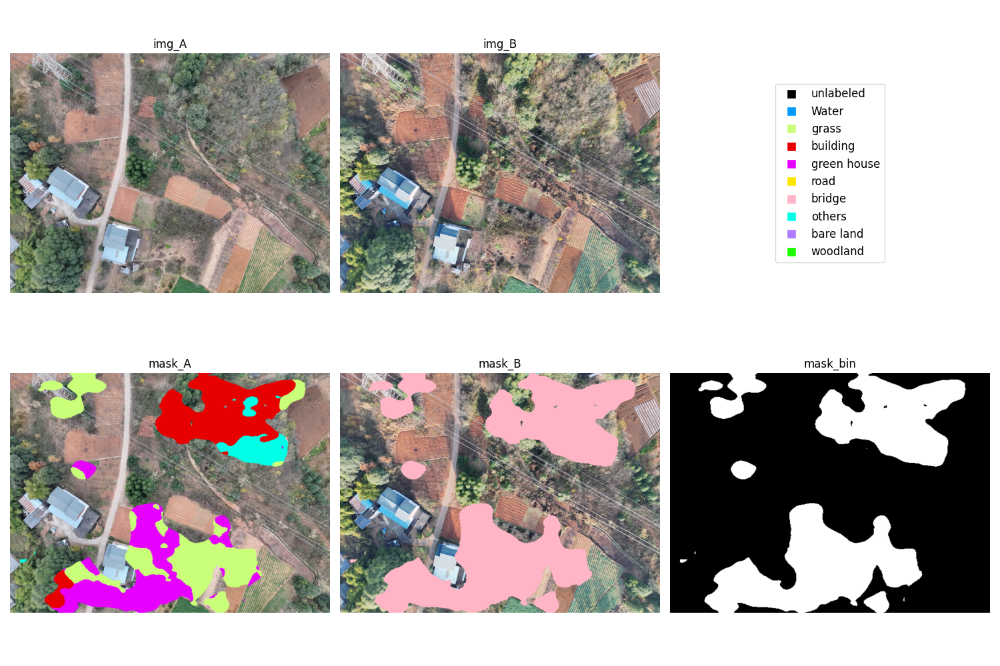
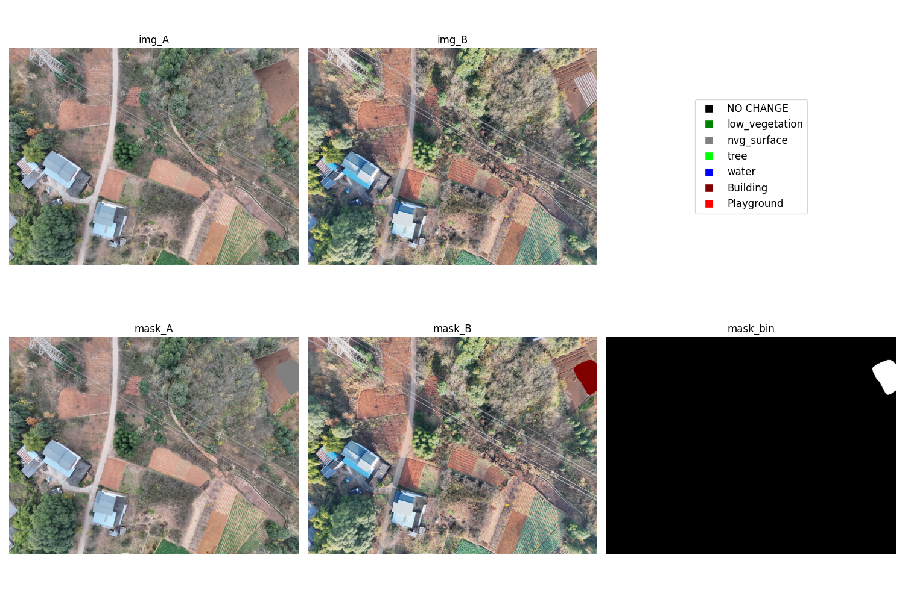
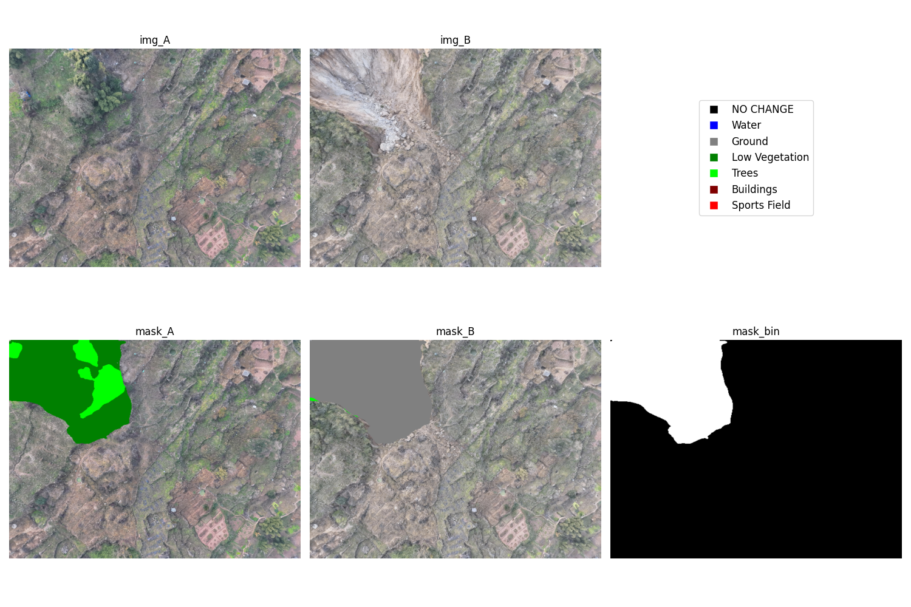

# file tree
```bash
+---
|   config.json # 所有模型的配置文件
|   test_gvlm_dataset.py # 测试模型在 GVLM 数据集上的表现
|   test_matcher.py # 测试图像匹配算法
|   test_time.py # 解析 log，获取模型平均运行时间
+---images # 存放一些展示图
+---res # 存放数据集和模型路径
|   \---data
|       +---GVLM_CD # GVLM_CD 数据集格式
|       |   \---<LAND_TYPE>
|       |           im1.png
|       |           im2.png
|       |           ref.png
|       +---SECOND # 按照 GVLM 数据集存放格式
|       \---UAV
+---scripts # 一些模型转换脚本
\---src
    |   data_gen.py # 读数数据集
    |   logger.py # 单例模式的 logger
    |   matcher.py # 图像匹配算法
    |   ort_runner.py # onnxruntime
    |   trt_runner.py # tensorRT
    |   
    \---model # 继承 ort_runner.py 的模型运行代码
```

# model list
all onnx model can download from [huggingface](https://huggingface.co/i2w3/model_zoo)

## [ClearSCD](https://github.com/tangkai-RS/ClearSCD)


## [DEFO](https://github.com/byyztgxz/Decoder_Fusion)


## [SCanNet](https://github.com/DingLei14/SCanNet)


## [SE2020](https://github.com/LiheYoung/SenseEarth2020-ChangeDetection)


# more model
[open-cd](https://github.com/likyoo/open-cd) base on MMLab Toolkits

[sota-cd](https://hyper.ai/cn/sota/tasks/change-detection)

[Benchmark SECOND Dataset](https://github.com/ale93111/awesome-semantic-change-detection?tab=readme-ov-file#benchmark)

[awesome-remote-sensing-change-detection](https://github.com/wenhwu/awesome-remote-sensing-change-detection) 

[Change-Detection-Review](https://github.com/MinZHANG-WHU/Change-Detection-Review)

## SECOND DATASET
|               Model               |  mIoU |  SeK  | Score | Status                  |
| :-------------------------------: | :---: | :---: | :---: | :---------------------: |
|                TaCo               | 73.77 | 24.73 | 39.44 | No Code                 |
|               DaCDF               | 72.30 | 21.88 | 37.00 | No Git                  |
|             UniChange             | 72.85 | 23.02 | 37.97 | No Code                 |
|              GSTM-SCD             | 73.61 | 24.36 | 39.13 | Mamba-base, have weight |
|                FoBa               | 74.50 | 24.61 | 39.58 | Mamba-base, have weight |
|              Mamba-FCS            | 74.07 | 25.50 | 40.07 | No Git                  |
|             AWMambaSCD            | 73.66 | 24.95 | 39.56 | No Git                  |
|               BT-SCD              | 73.67 | 24.21 | 39.04 | No Git                  |
|               STGNet              | 72.83 | 22.45 | 37.56 | No Git                  |
| SCanNet + CBAM + L<sub>Dice</sub> | 73.63 | 24.25 | 39.06 | No weight               |
|               SCNet               | 73.85 | 23.99 | 38.95 | wait GDrive Assess      |
|             VFM-ReSCD             | 73.33 | 24.01 | 38.81 | No weight               |
|            Semantic-CD            | 75.10 | 23.85 | 39.23 | No Git                  |
|             MamabaSCD             | 73.68 | 22.92 | 38.15 | Mamba-base, have weight |
|              SCD-SAM              | 77.75 | 32.44 | 46.03 | SAM-base, have weight   |
|              LSAFNet              | 74.01 | 24.32 | 39.23 | No weight               |
|               HGINet              |   --  |   --  |   --  | No weight               |
|            DEFO-MLTSCD            | 73.76 | 23.73 | 38.74 | `PASS`                  |
|               DFINet              | 72.61 | 20.12 | 35.87 | No Git                  |
|              SCanNet              | 73.42 | 23.94 | 38.78 | `PASS`                  |