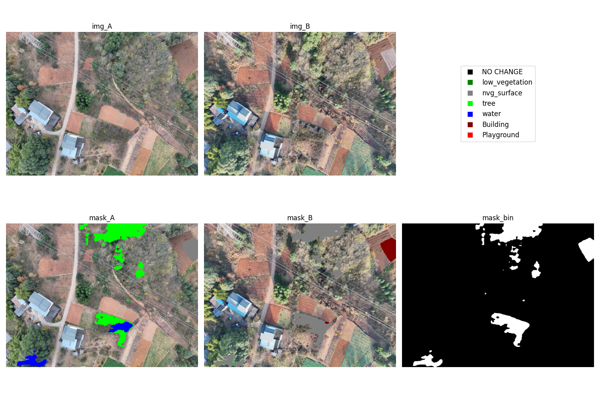
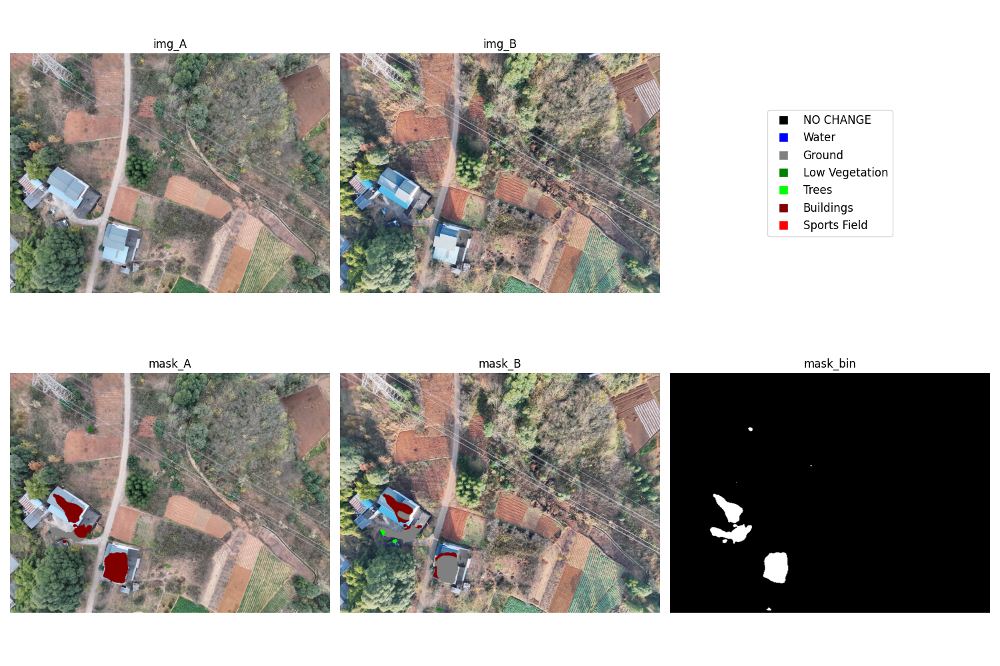

# file tree
```bash
+---
|   config.json # 所有模型的配置文件
|   test_gvlm_dataset.py # 测试变化检测模型在 GVLM 数据集格式上的表现
|   test_uav_dataset.py # 测试语义分割模型再 UAV2 数据集格式上的表现
|   test_matcher.py # 测试图像匹配算法
|   test_time.py # 解析 log，获取模型平均运行时间
+---images # 存放一些展示图
+---res # 存放数据集和模型路径
|   \---data
|       +---GVLM_CD # GVLM_CD 数据集格式
|       |   \---<LAND_TYPE>
|       |           im1.png
|       |           im2.png
|       |           ref.png
|       +---SECOND # 按照 GVLM 数据集存放格式
|       \---UAV
+---scripts # 一些模型转换脚本
\---src
    |   data_gen.py # 读数数据集
    |   logger.py # 单例模式的 logger
    |   matcher.py # 图像匹配算法
    |   ort_runner.py # onnxruntime
    |   trt_runner.py # tensorRT
    |   
    \---model # 继承 ort_runner.py 的模型运行代码
```

# model list
all onnx model can download from [huggingface](https://huggingface.co/i2w3/model_zoo)

## [Semantic Change Detection]
| Model           |                 |
| :-------------: | :-------------: |
| [ClearSCD](https://github.com/tangkai-RS/ClearSCD) | [DEFO](https://github.com/byyztgxz/Decoder_Fusion) |
|                          |                              |
| [SCanNet](https://github.com/DingLei14/SCanNet) | [SE2020](https://github.com/LiheYoung/SenseEarth2020-ChangeDetection) |
|                        |                                               |

## [Remote sensing semantic segmentation]
运行逻辑：由于直接输入原图，会在模型预处理被压缩成 512*512，效果很差(左列)，所以可以采用裁剪子图拼接(中列，按照图块大小为 512，步长为 416(意味着图块与图块之间会有 96 像素大小的区域重叠) 进行裁剪，随后逐个图块计算语义值概率，最后叠加计算总图语义)，但是子图中物体太大，所以最好再做一次原图分辨率压缩(模拟原始数据集的物体大小, zt 2 表示压缩两次)

一些比较合适的数据集：[LoveDA](https://github.com/Junjue-Wang/LoveDA)、[EarthVQA](https://github.com/Junjue-Wang/EarthVQA)、[FloodNet](https://www.kaggle.com/datasets/aletbm/aerial-imagery-dataset-floodnet-challenge)、[DroneDeploy](https://www.kaggle.com/datasets/mightyrains/drone-deploy-medium-dataset)

### [EarthVQA]
| (3024, 4032, 3) | (3024, 4032, 3) + 裁剪子图(重叠 96 以消除边缘效应) | (3024, 4032, 3) 压缩 (1512, 2016, 3) + 裁剪子图 |
| :-------------: | :-------------: | :-------------: |
|  |  |  |

## more model
[open-cd](https://github.com/likyoo/open-cd) base on MMLab Toolkits

[sota-cd](https://hyper.ai/cn/sota/tasks/change-detection)

[Benchmark SECOND Dataset](https://github.com/ale93111/awesome-semantic-change-detection?tab=readme-ov-file#benchmark)

[awesome-remote-sensing-change-detection](https://github.com/wenhwu/awesome-remote-sensing-change-detection) 

[Change-Detection-Review](https://github.com/MinZHANG-WHU/Change-Detection-Review)

# Image matching
see `test_matcher.py` and `./src/matcher.py`
| Method           |                 |
| :-------------: | :-------------: |
| SIFT | SUFT |
|  |  |
| ORB | ORB[CUDA] |
|  |  |
| AKAZE |  |
|  |  |