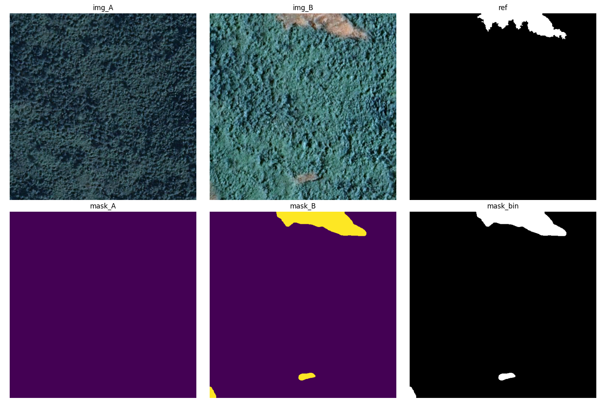

# TODO
- [x] 实现 [SE2020](https://github.com/LiheYoung/SenseEarth2020-ChangeDetection) 的 ONNX 格式转换和 TensorRT::fp16/int8(ort_qdq无法导出, 使用trt_native) 引擎导出，并完成推理流程
- [x] 实现 SE2020 在 [GVLM_CD](https://www.kaggle.com/datasets/gbhavi/gvlm-change-detection) 数据集上推理(SE2020 的训练数据与 GVLM_CD 数据集不匹配，仅用来测试代码功能 ./test_gvlm_dataset.py)
- [ ] 模拟 UAV 第一次飞行与第二次飞行不一定匹配的问题(目前使用有大图的遥感数据集 GVLM_CD，方便在上面随机裁剪然后进行匹配，但是遥感图像拍摄年代差别较久，图像上的特征点难以匹配)

## SE2020
converted onnx model upload to [huggingface](https://huggingface.co/i2w3/model_zoo)

### result of SE2020 test on GVLM_CD
仅关注地面变化，使用相同的随机种子在 GVLM_CD 数据集每种地形上均裁剪 100 张子图进行预测：
|       model      | run_time | mIoU | time |
|:----------------:|:--------:|:----:|:----:|
| pspnet_hrnet_w18 | trt:int8 |      |     s|
|                  | trt:fp16 |0.6940|0.164s|
| pspnet_hrnet_w40 | trt:int8 |      |     s|
|                  | trt:fp16 |0.6893|0.189s|

# more model
[open-cd](https://github.com/likyoo/open-cd) base on MMLab Toolkits

[awesome-remote-sensing-change-detection](https://github.com/wenhwu/awesome-remote-sensing-change-detection) 

[Change-Detection-Review](https://github.com/MinZHANG-WHU/Change-Detection-Review)