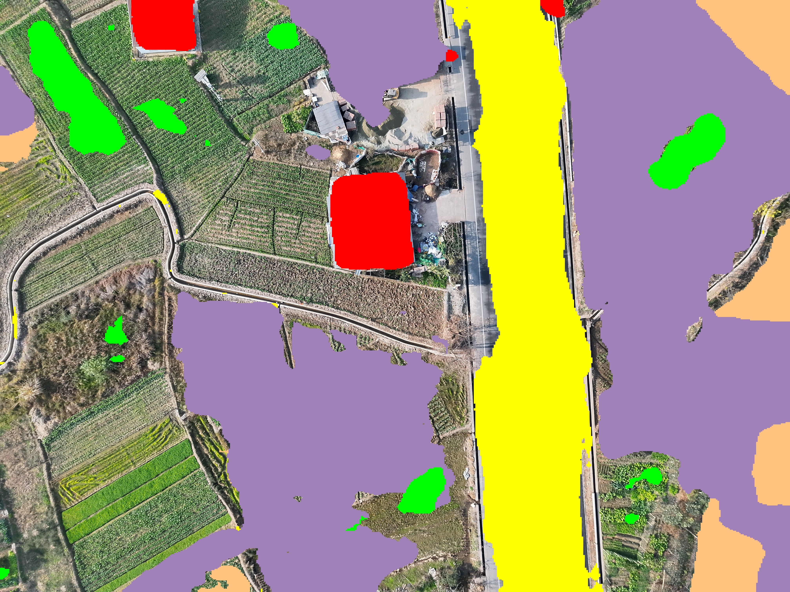
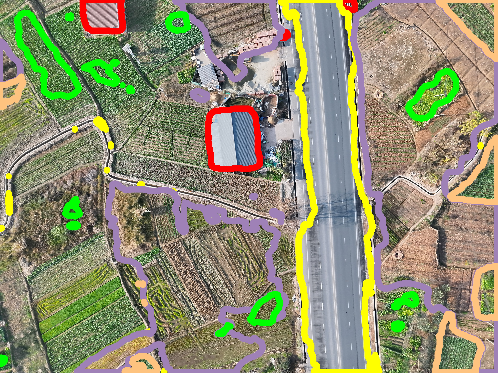

# EarthVQA(Dataset)
官方代码库在 [Github](https://github.com/Junjue-Wang/EarthVQA)，提供的数据集下载链接在[百度网盘](https://pan.baidu.com/s/1VBS4IHzA9w9mwLfqUxiN6A?pwd=2333)，也可以从 [kaggle](https://www.kaggle.com/datasets/dyiyacao/earthvqa) 下载。数据集最开始源自 [LoveDA](https://github.com/Junjue-Wang/LoveDA)，然后拓展到 EarthVQA，最后到 2026/01/08 推出 [EarthVL](https://github.com/Junjue-Wang/EarthVL) (主要更新点在于将 EarthVQA 的范围从中国扩展到全球)

## 数据集组织格式
以 kaggle 上的第三方为准，image 和 mask 的文件名均相同(eg: 0.png)，分别存放在 images_png 和 masks_png 中。
```
EarthVQA/
├── Train/          # train
│   ├── images_png/
│   └── masks_png/
├── Val/            # val
|   ├── images_png/
|   └── masks_png/
└── images_png/     # test
```

### mask 标签
```json
0: "Ignore"         # 忽略
1: "Background"     # 背景
2: "Building"       # 建筑
3: "Road"           # 道路
4: "Water"          # 水
5: "Barren"         # 裸地
6: "Forest"         # 森林
7: "Agricultural"   # 农业
8: "Playground"     # 操场
9: "Pond"           # 池塘
```

### 标注方法
语义分割较为简单，不需要用 GIS 类软件，找些支持多边形标注的软件(eg: labelme)，配合脚本转换成 mask 图即可。

# EMoT(Model)
[EMOT](https://github.com/tue-mps/eomt) 源自 CVPR 2025 Highlight <Your ViT is Secretly an Image Segmentation Model>，训练脚本来自[lightly-train](https://github.com/lightly-ai/lightly-train)(`这个代码库工程化做的好，支持导出 onnx + tensorRT`)，需要先用 DinoV2 的方式在 EarthVQA 的测试集上预训练一个 Vit 做为主干，再用来训练 EMOT。

建议先看 lightly-train 的 EoMT 训练文档：https://docs.lightly.ai/train/stable/semantic_segmentation.html，后面有说如何使用预训练主干，再看 lightly-train 的 DinoV2 预训练文档：https://docs.lightly.ai/train/stable/pretrain_distill/methods/dinov2.html

# Code
0. 集合
EoMT trainer: https://github.com/i2w3/PytorchSegmentation
EoMT ONNX RUNNER: https://github.com/i2w3/ChangeDetection

1. 下载 EarthVQA 数据集，可以从 [kaggle](https://www.kaggle.com/datasets/dyiyacao/earthvqa) 下载
```python
# 建议设置一下代理方便从 kaggle 上面下载数据
import os
os.environ['HTTP_PROXY'] = 'http://{PROXY_IP}:{PROXY_PORT}'
os.environ['HTTPS_PROXY'] = 'http://{PROXY_IP}:{PROXY_PORT}'

import kagglehub
path = kagglehub.dataset_download("dyiyacao/earthvqa")
print("Path to dataset files:", path) # 一般下载到 ~/.cache/kagglehub/dataset/
```

2. 预处理 EarthVQA 数据集，按照下面的形式组织文件，且重新映射 mask 标签值，代码可以从[这里](https://github.com/i2w3/PytorchSegmentation/blob/main/scripts/build_EarthVQA.py)下载
```bash
EarthVQA/
├── Train/
│   ├── images_png/
│   └── masks_png/
├── Val/
|   ├── images_png/
|   └── masks_png/
└── Test/
    └── images_png/
```
```json
0: Background (包含原始的 Ignore 类别) 34.0%
1: Building 7.0%
2: Road 4.6%
3: Water (包含 Pond 类别) 12.0%
4: Barren 4.3%
5: Forest 7.5%
6: Agricultural 30.5%
7: Playground 0.1%
```
```python
from pathlib import Path
from typing import List
import shutil

import cv2
import kagglehub
import numpy as np
from tqdm import tqdm


def change_name(path:Path, old_name:str, new_name:str) -> Path:
    # 将 TARGET_PATH 中的 OLD_NAME 替换为 NEW_NAME
    paris = path.parts
    if old_name in paris:
        new_parts = [new_name if part == old_name else part for part in paris]
        return Path(*new_parts)
    return path


def process(image_path:List[Path], save_path: Path) -> None:
    Path.mkdir(save_path / "images_png", parents=True, exist_ok=True)
    Path.mkdir(save_path / "masks_png", parents=True, exist_ok=True)
    for img_path in tqdm(image_path, desc=f"Copying images to {save_path}"):
        shutil.copy(img_path, save_path / "images_png")
        mask_path = change_name(img_path, "images_png", "masks_png")
        mask_data = cv2.imread(str(mask_path), cv2.IMREAD_GRAYSCALE)
        if mask_data is None:
            print(f"Warning: mask_data is None for {mask_path}")
            continue
        # 修改 mask 标签，将标签从 1-9 变为 0-8，并将 pond 类别（8）改为 water 类别（3）
        for i in range(1, 10):
            mask_data[mask_data==i] = i-1
        mask_data[mask_data==8] = 3 # 将 pond 类别改为 water 类别
        cv2.imwrite(save_path / "masks_png" / img_path.name, mask_data)


if __name__ == "__main__":
    data_path = Path(kagglehub.dataset_download("dyiyacao/earthvqa"))
    save_path = Path("./datasets/EarthVQA")

    split = "train"
    save_path_split = save_path / split.capitalize()
    image_path = list((data_path / split.capitalize()).rglob("images_png/*.png"))
    process(image_path, save_path_split)

    split = "val"
    save_path_split = save_path / split.capitalize()
    image_path = list((data_path / split.capitalize()).rglob("images_png/*.png"))
    process(image_path, save_path_split)
    # 分析一下 val 集的 mask 分布
    unique_values = set()
    class_counts = {}
    for valid_sample in tqdm(list((save_path_split / "masks_png").rglob("*.png")), desc="Analyzing val masks"):
        mask  = cv2.imread(str(valid_sample), cv2.IMREAD_GRAYSCALE)
        if mask is None:
            raise FileNotFoundError(f"Mask not found or corrupt: {valid_sample}")
        unique_value = np.unique(mask)
        for c in unique_value:
            int_c = int(c)
            class_counts[int_c] = class_counts.get(int_c, 0) + (mask == int_c).sum().item()
        unique_values.update(unique_value)
    print("Unique pixel values in validing mask images:", unique_values)
    total_pixels = sum(class_counts.values())
    class_freqs = {k: v / total_pixels for k, v in class_counts.items()}
    for k, v in sorted(class_freqs.items()):
        freq = 100.0 * v
        print(f"  Class {k}: {freq:5.1f}%")

    split = "test"
    save_path_split = save_path / split.capitalize()
    image_path = list((data_path / "images_png").rglob("*.png"))
    Path.mkdir(save_path_split / "images_png", parents=True, exist_ok=True)
    for img_path in tqdm(image_path, desc="Copying test images"):
        shutil.copy(img_path, save_path_split / "images_png")
```

3. 训练 EoMT
训练脚本可以从[这里](https://github.com/i2w3/PytorchSegmentation/blob/main/train_eomt.py)下载，环境构建：
```bash
mamba create -n eomt python=3.12
mamba activate eomt
pip install lightly-train==0.14.0
```

使用 EarthVQA 的 Test 数据集预训练一个 VIT，修改变量 MODEL 来选择训练哪种 size 的 VIT，注意容易出现 Dataloader 崩溃而导致程度死锁，建议定期查看预训练过程：
```bash
python train_eomt.py 1
```

训练完成后，使用预训练的 VIT 做为 EoMT 的主干，脚本会自动完成路径的修改，训练出来的模型可以到[这里](https://github.com/i2w3/PytorchSegmentation/releases)下载：
```bash
python train_eomt.py 2
```

训练的过程中查看模型的性能，图片会生成在 `./assets` 里：
```bash
python train_eomt.py 3 --ids 1
```

导出 `best.ckpt` 到 `.onnx` 格式：
```bash
python train_eomt.py 4
```

4. 使用 onnx
- 输入 images ["B", 3, 512, 512]，预处理代码如下：
```python
def preProcess(img:np.ndarray) -> np.ndarray:
    shape = img.shape[:2]
    input_size = (512, 512)
    if shape[0] != 512 or shape[1] != 512
        img = cv2.resize(img, input_size)
    mean_array = np.array([0.485, 0.456, 0.406], np.float32).reshape(1,3,1,1)
    std_array  = np.array([0.229, 0.224, 0.225] , np.float32).reshape(1,3,1,1)
    # only swapRB
    blob = cv2.dnn.blobFromImage(img, scalefactor=1.0, size=input_size, mean=(0,0,0), swapRB=True, ddepth=cv2.CV_32F) 
    blob = (blob - mean_array) / std_array
    return blob
```
- 输出 masks ["B", 512, 512] 和 logits ["B", num_classes, 512, 512]，后处理代码如下：
```python
def postProcess(self, outputs_blob:List[np.ndarray]) -> np.ndarray:
    # 0. outputs_blob = [masks, logits]
    assert len(outputs_blob) == 2:
    # 1. 处理一下 logits
    output_bin = outputs_blob[1] 
    np_bin = np.argmax(output_bin, axis=1).astype(np.uint8)
    return np_bin[0]
    # 2. 直接取 mask
    return outputs_blob[0][0]
```
- 加上轮廓检测的代码如下：
```python
from typing import Dict, List

def get_contour(image:np.ndarray, mask: np.ndarray) -> Dict[int, List[np.ndarray]]:
    h, w = image.shape[:2]
    h_ratio = h / mask.shape[0]
    w_ratio = w / mask.shape[1]

    num_classes = 8
    contour_dict = {}
    for i in range(1, num_classes):
        binary = (mask == i).astype(np.uint8)
        contours, _ = cv2.findContours(binary,cv2.RETR_EXTERNAL,cv2.CHAIN_APPROX_SIMPLE)
        if len(contours) > 0:
            scaled_contours = []
            for cnt in contours:
                cnt = cnt.astype(np.float32)
                # scale mask to image
                cnt[:, 0, 0] *= w_ratio
                cnt[:, 0, 1] *= h_ratio
                scaled_contours.append(cnt.astype(np.int32))
            contour_dict[i] = scaled_contours

    # 不画图可以注释掉
    contour_canvas = image.copy()
    class_map = [[0, 0, 0], [255, 0, 0], [255, 255, 0], [0, 0, 255], [159, 129, 183], [0, 255, 0], [255, 195, 128], [165, 0, 165], [255, 255, 255]]
    for k, v in contour_dict.items():
        color_rgb = class_map[k]
        color_bgr = (color_rgb[2], color_rgb[1], color_rgb[0])
        cv2.polylines(contour_canvas, v, isClosed=True, color=color_bgr, thickness=50)
    return contour_dict
```
| mask | contour |
| :--: | :-----: |
|  |  |

5. 完整的伪代码
```python
model = onnx_runner(model_path)
image_data = cv2.imread(image_path)
image_blob = preProcess(image_data)
outputs_blob = model({"images": image_blob})
mask = postProcess(outputs_blob)
contour = get_contour(mask)
```

也可以使用这个 [EoMT ONNX RUNNER](https://github.com/i2w3/ChangeDetection/blob/master/test_uav_dataset.py)(先完整克隆项目)，环境要求：
```
pip install onnxruntime-gpu opencv-python matplotlib
```
运行命令，-zt 表示压缩图片次数，以模拟高空卫星视角，模型路径和配置见 `./config.json` 里的 `EoMT` 字段，建议使用[这里](https://github.com/i2w3/PytorchSegmentation/releases)的有 `*nopond.onnx` 的模型，合并了 water 和 pond 标签：
```
python test_uav_dataset.py EoMT -zt 0
```
